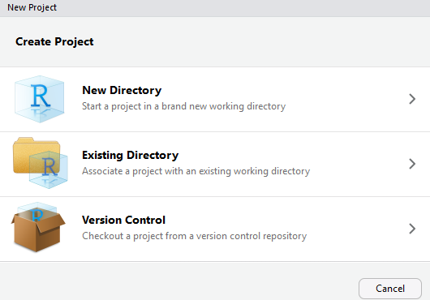
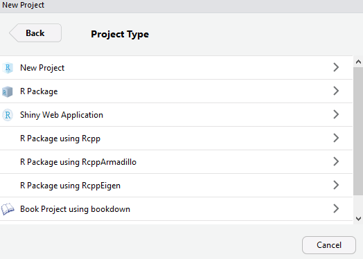
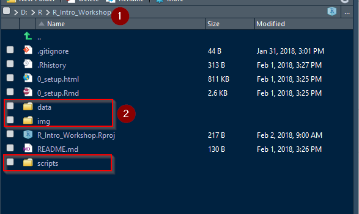

```{r setup, include=FALSE}
knitr::opts_chunk$set(echo = TRUE)
library(tidyverse)
```

# Installing R and RStudio

Download R from a CRAN mirror of your choice. You can use Microsoft R Open if you wish, but be aware that there are some changes that exist between their flavor of R, and the base R from CRAN. 

OSU Mirror here:
<https://ftp.osuosl.org/pub/cran/>

Download RStudio Desktop from RStudio. Other editors like Atom, Jupyter Notebook, and Visual Studio 2015+ do work, but RStudio is the one I recommend. 

<https://www.rstudio.com/products/rstudio/download/>

# Install R packages

The power of R comes through the packages that are written to extend R code. Many pacakges leverage compiled langauges like C++ through the `Rcpp` package, speeding up R immensely. 


```{r, eval=FALSE}

install.packages(c("tidyverse", "caret", "leaflet", "viridis", "rgdal", "rgl","vcd","dismo","raster", "RODBC","rgeos","snowfall","ROCR","randomForest", "DBI"))

```


## Package help

```{r, eval=FALSE}

help(package="ggplot2") # gets the local help file for the package
?ggplot # gets the local help file for a function within a package (provided the package is loaded)
??ggplot # searches for all mentions of 'ggplot' regardless of whether a package is loaded. 

```

# RStudio Interface

There is a lot to RStudio but we'll cover some key features. 

* Scripts
* Console
* Files/Plots/Packages
* Environment

And how to change it all to suit your own preferences...

## Keyboard Shortcuts and Cheatsheets

Help >> Keyboard Shortcuts Help (Alt + Shift + K)

Help >> Cheatsheets >> Pick a cheat sheet

## Other documentation resources

https://cran.r-project.org/doc/contrib/Baggott-refcard-v2.pdf

http://www.u.arizona.edu/~kuchi/Courses/MAT167/Files/R-refcard.pdf

https://cran.r-project.org/other-docs.html

# Working Directory

R compartmentalizes code in working directories. This allows for paths to files to be relative instead of absolute, which facilitates sharing code between computers. 

`C:\MyDirectory\ThisProject\2018\Phase1\MyFile.R` is an absolute path. Not good. 

`MyFile.R` is the relative path, provided your working directory is `C:\MyDirectory\ThisProject\2018\Phase1`

```{r, eval=FALSE}
getwd() # displays current working directory
setwd() # sets working directory to the path you specify
```

## Projects in RStudio

RStudio allows for you to create discrete project directories, which become the working directory for that project. 

File >> New Project... >> Select location







All of my projects have a similar structure once inside of the project directory. 

1. Item `1` shows the path to your project folder. 
2. Folders
  +  `data` folder for the raw data. 
  + `img` folder when I save plots as images, or need images in a presentation.
  + `scripts` for any scripts I use. 
  
  
