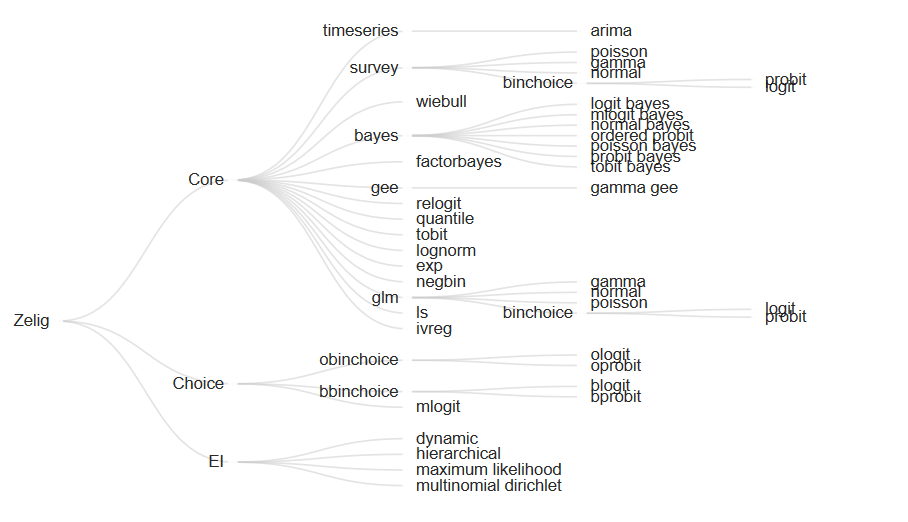

```{r setup, include=FALSE}
knitr::opts_chunk$set(echo = TRUE)
library(tidyverse)
library(zeligverse)
```

# Intro

This series of exercises is intended to introduce you to basic statistical operations in R. We'll touch on descriptive statistics, linear models, and get a quick tour of the `zeligverse` collection of packages by Gary King. The `zeligverse` collection is the de facto stats package for social scientists, and aims to improve on some of the base R quirks. 

```{r}
library(tidyverse)
library(zeligverse)
```

## Load data

The `swiss` dataset contains data on fertility and socioeconomic factors in Switzerland’s 47 French-speaking provinces in 1888 (Mosteller and Tukey, 1977, 549-551).

```{r}
data(swiss)
str(swiss)
```

## Descriptive stats

```{r}
mean(swiss$Fertility)
sd(swiss$Fertility)
max(swiss$Fertility)

summary(swiss$Education)

```


## Hypothesis testing

```{r}
t.test(swiss$Fertility, mu=60)
```


## Linear model

```{r}
#base R way

fit1 <- lm(Fertility ~ Education, data = swiss)
summary(fit1)
```

## Zelig Project



```{r}
z5_1 <- zelig(Fertility ~ Education, model = "ls", data = swiss, cite = FALSE)
summary(z5_1)

```

The `-0.86` coefficient suggests there is a large negative effect on Fertility with increasing Education. Let's explore those differences further using `setx()` and `setx1()`. 

```{r}
# set education to 5% and 15% of the population
z5_1 <- setx(z5_1, Education = 5) 
z5_1 <- setx1(z5_1, Education = 15)

z5_1 <- sim(z5_1)


```

Plot the differences from our simulated Education levels. 

```{r, fig.height = 10, fig.width = 6}
plot(z5_1)
```

We can also do this for a range of values

```{r}
z5_2 <- zelig(Fertility ~ Education, model = "ls", data = swiss, cite = FALSE)

# set Education to range from 5 to 15 at single integer increments
z5_2 <- setx(z5_2, Education = 5:15)

# run simulations and estimate quantities of interest
z5_2 <- sim(z5_2)
# Then use the plot() function as before:

z5_2 <- plot(z5_2)
```


### `Zelig` the `tidyverse` way

`zelig` works with `tidyverse` nicely as well. We can incorporate `zelig()` models into our workflow unlike the base R models. 


```{r}
swiss %>% 
    zelig(Fertility ~ Agriculture + Examination, model = 'ls', data = ., 
          cite = FALSE) %>%
    setx(Agriculture = seq(1, 90, by = 5)) %>%
    sim() %>% 
    plot()x
```


