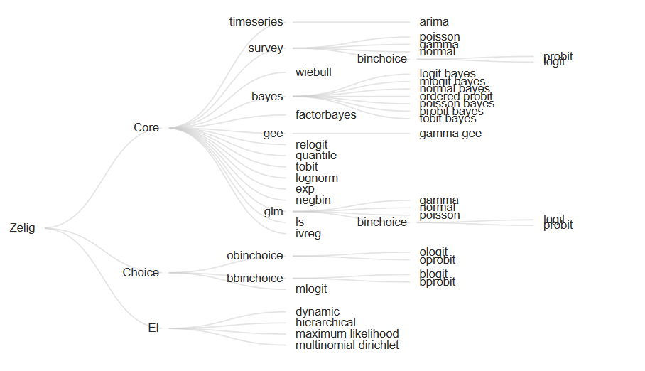

```{r setup, include=FALSE}
knitr::opts_chunk$set(echo = TRUE)
library(tidyverse)
library(zeligverse)
```

# Intro

This series of exercises is intended to introduce you to basic statistical operations in R. We'll touch on descriptive statistics, linear models, and get a quick tour of the `zeligverse` collection of packages by Gary King. The `zeligverse` collection is the de facto stats package for social scientists, and aims to improve on some of the base R quirks. Where applicable, I'll try to include the base-R equivalent functions so you learn them as well.  

```{r}
library(tidyverse)
library(zeligverse)
```

# Load data

The `swiss` dataset contains data on fertility and socioeconomic factors in Switzerland’s 47 French-speaking provinces in 1888 (Mosteller and Tukey, 1977, 549-551).  

```{r}
data(swiss)
str(swiss)
```

[,1]	 Fertility	Ig, ‘common standardized fertility measure’
[,2]	 Agriculture	 % of males involved in agriculture as occupation
[,3]	 Examination	 % draftees receiving highest mark on army examination
[,4]	 Education	 % education beyond primary school for draftees.
[,5]	 Catholic	 % ‘catholic’ (as opposed to ‘protestant’).
[,6]	 Infant.Mortality	 live births who live less than 1 year.
All variables but ‘Fertility’ give proportions of the population.


# Descriptive stats

```{r}
mean(swiss$Fertility)
sd(swiss$Fertility)
max(swiss$Fertility)
summary(swiss$Education)

```

## A slightly better description

`Hmisc` is a large package of useful r functions and contains a better descriptive summary than base R, I think. One thing to note, though, is `Hmisc` and `dplyr` have some conflicting function names (particularly, `summarize`). You want to call the package explicitly to be sure you know what you are calling. For example, `dplyr::summarize` instead of just `summarize`. 

```{r}
library(Hmisc)
Hmisc::describe(swiss)

detach("package:Hmisc", unload=TRUE) # unload the package afterward
```


# Hypothesis testing

Student's t-Test is called with `t.test()` and the mean specified as `mu`. 

```{r}
t.test(swiss$Fertility, mu=60)
```


# Linear modeling
Building a linear model in baseR R is fairly straightforward via the `lm` model. 
```{r}
#base R way
fit1 <- lm(Fertility ~ Education, data = swiss)
summary(fit1)
```

R's `plot.lm` method is helpful for evaluating whether the data distributions fit the assumptions inherent to the statistical test.

```{r}
par(mfrow =c(2,2))
plot(fit1)
```

Models can be compared by the `anova` function.

```{r}
fit2 <- lm(Fertility ~ Education + Catholic, data = swiss)
anova(fit1,fit2)
```

Stepwise selection for linear models can be conducted with the `step` function, which chooses a model based on Akaike's Informatin Criteria (AIC).

```{r}
fit3<-lm(Fertility~.,data = swiss)
fit4<-step(fit3)
par(mfrow =c(2,2))
plot(fit4)
par(mfrow =c(1,1))
```

Many models can be compared simultaneously with `anova`.
```{r}
anova(fit3,fit4,fit2,fit1)
```
We can see that the residual sums of squares for our `fit3` and `fit4` models are very similar, while the first two models that we made do not fit the `Fertility` response variable as closely.  


# Zelig Project

Using the `zeligverse` packages that collectively are referred to as the Zelig Project, we can accomplish much of what is in base R stats with some extra quality of life improvements. From the Zelig Project documentation:

>Zelig adds considerable infrastructure to improve the use of existing methods. It translates hard-to-interpret coefficients into meaningful quantities of interest, along with the uncertainty estimates (generalizing Clarify for Stata); automates graphics and numerical summaries for all models.

>Zelig can also evaluate counterfactuals (via WhatIf); combine multiply imputed data sets to impute missing data and correct for measurement error (via Amelia and other multiple imputation functions); automates bootstrapping for all models; allows for matching for causal inference to reduce model dependence (via MatchIt and cem); and generates replication data files (for Dataverse to satisfy community replication standards).



This image illustrates all of the models available in the package(s). 

```{r}
z5_1 <- zelig(Fertility ~ Education, model = "ls", data = swiss, cite = FALSE) # cite=FALSE will keep the citation reminder suppressed
summary(z5_1)

```

The `-0.86` coefficient suggests there is a large negative effect on Fertility with increasing Education. Let's explore those differences further using `setx()` and `setx1()`. This will allow us to simulate differing proportions of the educated population. 

```{r}
# set education to 5 and 15
z5_1 <- setx(z5_1, Education = 5) 
z5_1 <- setx1(z5_1, Education = 15)

z5_1 <- sim(z5_1)


```

Plot the differences from our simulated Education levels. 

```{r, fig.height = 10, fig.width = 6}
plot(z5_1)
```

We can also do this for a range of values

```{r}
z5_2 <- zelig(Fertility ~ Education, model = "ls", data = swiss, cite = FALSE)

# set Education to range from 5 to 15 at single integer increments
z5_2 <- setx(z5_2, Education = 5:15)

# run simulations and estimate quantities of interest
z5_2 <- sim(z5_2)
# Then use the plot() function as before:

z5_2 <- plot(z5_2)
```


### `Zelig` the `tidyverse` way

`zelig` works with `tidyverse` nicely as well. We can incorporate `zelig()` models into our workflow unlike the base R models. 


```{r}
swiss %>%
    zelig(Fertility ~ Agriculture + Examination, model = 'ls', data = .,
          cite = FALSE) %>%
    setx(Agriculture = seq(1, 90, by = 5)) %>%
    sim() %>%
    plot()
```

You can even get first differences in the same workflow. 


```{r, fig.height = 10, fig.width = 8}
swiss %>% 
    zelig(Fertility ~ Agriculture + Examination, model = 'ls', data = ., 
          cite = FALSE) %>%
    setx(Agriculture = 10) %>%
    setx1(Agriculture = 90) %>%
    sim() %>% 
    plot()
```

